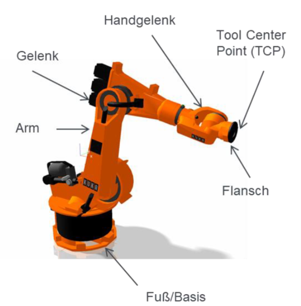

## 1.0 Einführung

### Verwendung von Robotern durch die Jahrzehnte

| Jahr     | Verwendung                                |
| -------- | ----------------------------------------- |
| **1973** | **Handling**                              |
| **1980** | **Assembly**                              |
| **1990** | **Service Robotics (Care-O-Bot)**         |
| **2000** | **Image Processing Bin Picking**          |
| **2010** | **Industry 4.0 ROS**                      |
| **2015** | **Artificial Intelligence Deep Grasping** |
| **2020** | **Automation of Automation**              |
| **2030** | **Cognitive Robotics**                    |

### Entwicklungen

- **Treibende Kraft**: Fachkräftemangel (auch in DE und EU)
  - Alterung der Bevölkerung
  - Fehlende Pflegekräfte
  - Komplexität der Aufgaben (Unkraut jäten, Schweißen, ...)
- Zahl der neu installierten Roboter steigt (2022: 553k), besonders in China (über die Hälfte)
- Zuwachs hauptsächlich in den Bereichen
  - **Unterhaltung** (v.a. Gastronomie) (+125%)
  - **Transport und Logistik** (+44%)
  - **Landwirtschaft** (+18%)
- Weite Verbreitung bereits in Automotive, Elektronik, Metall, Chemie, Lebensmittel
- Märkte: China, Korea, Japan, USA, Deutschland
- Wachstum 8-12% p.a. in der letzten Dekade

### Definition eines Roboters

- Nach ISO 8373: Ein Roboter ist ein programmierbarer Manipulator mit **drei oder mehr Achsen** für industrielle Anwendungen.
- Roboter erzeugen automatisch eine durch ein Programm beschriebene Bewegung, so dass sich einmal festgelegte Abläufe ohne Personaleinsatz reproduzieren lassen.
- Der Roboter ist eine **universell einsetzbare Maschine**, die für verschiedene Prozesse verwendet werden kann.

#### Begriffe

| Kriterium | Industrieroboter |  |  | Arm-Module | Kleinroboter |  |
| --- | --- | --- | --- | --- | --- | --- |
| Kinematik | Horizontaler Knickarm | Portalroboter | Vertikaler Knickarm | Gelenkmodule | Leichtbauroboter | Sicherer Roboter |
| a.k.a | SCARA | "auf Schienen" | KUKA | modular | COBOT | kollaborativ |
| max Traglast [kg] | 10 | 50-500 | 10-200 | ~10 | 7 | 4 |
| DOF | 4-5 | 3-6 | 5-6/6 | 2-7 | 7 | 6 |
| Wiederholgenauigkeit | hoch | mittel | hoch | mittel | mittel | hoch |
| Sensorführung | ✅ | ✅ | ✅ | ❌ | ✅ | ❌ |
| Kosten [k€] | 25 | 50-100 | 30-60 | 5/DOF | 60 | 50 |

#### Roboterzelle

- Typische Roboter-Stückkosten: **50.000 €** (einzeln)
- Systemkosten: **4-5-facher Roboterpreis**

### Automatisierung der Automatisierung

- Roboterinvest: **25-30% des Robotersystems**
- Personalkosten: **~40% des Robotersystems**
- Skaleneffekte werden durch Individualisierung (I4.0 $\rightarrow$ Unikate) aufgewogen
- Komplexe Automation ist zu **80% KVP / brown field**
- Viele manuelle (Experten-)Prozesse beim Umrüsten

$\rightarrow$ **Automatisierung der Automatisierung**

- Auslastungsoptimierte Matrixproduktion (höhere Auslastung, weniger Umrüsten)
- Automatisierte Layoutvorschläge (Fabrikhalle, Roboterzelle)
- Automatisierte Risikobeurteilung (Sicherheit)
- Autonome Verkettung mit Flurtransportsysteme (FTS)
- Selbstkonfigurierendes Bin Picking (Greifer, Kamera, Roboter)
- Selbstoptimierung Prozessparameter (z.B. Schweißparameter, Schwingungsdämpfung)

### Wirtschaftlichkeit

Generell lohnt sich ein Industrieroboter, wenn die **Stückkosten gering** sind und die **Stückzahlen hoch** sind. Während die **Pro-Stück-Kosten einer Transferlinie** (vgl. Förderband) linear abnehmen bei steigender Stückzahl, verhält sich das beim Roboter komplexer: Bei **geringeren Stückkosten als am manuellen Arbeitsplatz** und bei **geringeren Stückzahlen als bei der Transferlinie** lohnt sich der Roboter. Durch die **Reduktion der Anschaffungskosten** und die **Erhöhung der Flexibilität** wird dieser Punkt immer früher erreicht.

#### Argumente für eine neue Roboteranwendung

- Nutzung durch **Nicht-Experten** möglich
- **Flexibilität** und einfache Konfiguration
- Verbesserte Produktion
- Hohe Investitionsrendite
- Schnelle Amortisation
- Verbindung zum Zulieferer

#### Gründe für Nicht-Investition

- Zu kleine Losgrößen für die Automatisierung
- Keine automatisierungsgerechten Prozesse
- Automatisierung zu teuer
- Kein geeignetes Personal zur Nutzung von IR
- IR zu groß, zu unflexibel
- Programmierung zu aufwendig
- Sonstige Vorbehalte gegen IN-Einsatz
- Schlechte IR-Erfahrungen bekannter Firmen

#### Wann ist der Einsatz von Robotern sinnvoll?

| Anwendungsaspekt                           | Zustand        |
| ------------------------------------------ | -------------- |
| **Stückzahl**                              | **hoch**       |
| **Marktstabilität**                        | **hoch**       |
| **Notwendiger Entwicklungsaufwand**        | **gering**     |
| **Personalmarkt**                          | **angespannt** |
| **Erfahrung mit automatisierten Systemen** | **hoch**       |
| **Ergonomie**                              | **niedrig**    |
| **Qualitätsanforderungen**                 | **hoch**       |
| **Schichtmodell**                          | **24/7**       |

### Herausforderungen und Unsicherheiten

- **Toleranzen** im Werkstück und im Prozess können durch **Sensorik** ausgeglichen werden.
- **Marktvolatilität** kann durch **Wandlungsfähigkeit** ausgeglichen werden.
- **Datenvollständigkeit** kann durch **I4.0: Datenintegration** ausgeglichen werden.

### Beispiele moderner Anwendungen

- Vernetzte Flurtransportsysteme statt der Produktion am "Fließband"
- Programmierung durch Vorführung (z.B. Schweißen)
- **Flexibiliät** von mobilen Robotern beim Griff in die Kiste
- **Sensorgeführtes Schweißen**
