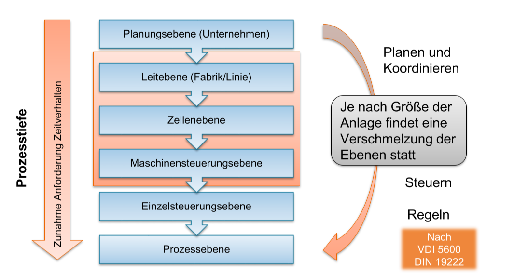

## 3.2 Steuerungstechnik

### Grundlagen der Steuerungstechnik

**Ein technischer Prozess** ist die Umformung und/oder der Transport von Materialien, Energie und/oder Information. Beispiele sind Fertigung von Teilen oder die Montage von Produkten.

**Eine Automatisierungseinrichtung** hat das Ziel, die Arbeit des Menschen im operativen Bereich zu erleichtern. Die Herausforderung ist prozesssicheres Einwirken des Nutzers durch Steuerungstechnik. Automatisierungsobjekte sind z.B. Roboter, Automaten, Fertigungssysteme und Werkzeugmaschinen.

**Der Mensch/Nutzer** hat die Aufgabe, die Automatisierungseinrichtung zu lenken und zu beobachten. Er hat Zugriff auf Führungsgrößen zur Beeinflussung der Anlage.

### Abgrenzung von Steuerung und Regelung

- Steuern — beschreibt den Vorgang zur Beeinflussung von Ausgangsgrößen eines Systems durch Einstellen von Eingangsgrößen
- Regeln — beschreibt den Vorgang bei dem fortlaufend eine Regelgröße erfasst und mit einer Führungsgröße verglichen wird (Regelabweichung), so dass die Regelgröße der Führungsgröße nachfolgt
- Vergleich:
  - Geschlossener Wirkungskreis durch Rückkopplung der Regelgröße
  - Ständiger Vergleich von Soll- und Istwert des geschlossenen Wirkungskreises ermöglicht die Reduzierung von Störgrößen

### Organisation und Hierarchie einer Steuerung

**Automatierungspyramide:**

- ERP: Enterprise Resource Planning (Planungsebene)
- MES: Manufacturing Execution System (Betriebsleitebene)
- SCADA: Supervisory Control and Data Acquisition (Prozessleitebene)
- PLC: Programmable Logic Controller (Steuerungsebene/SPS)
- Bus: Feldbus (Feldgeräteebene)

**Leitebene / Zellenebene / Maschinensteuerungsebene:**

- Leitebene: Lenken, Zusammenfassen, Verwalten
  - Programmverwaltung, Systemabbildung, Aufbereiten von Betriebsdaten
  - Einbeziehung des Nutzers zur Lenkung und Organisation des Prozesses
- Zellenebene: Koordinieren und Verteilen
- Programmverteilung, Verwaltung von Werkzeug- und Werkstückdaten, Steuerdatengenerierung für Werkstück- und Werkzeugfluss in der Zelle, Auswerten von Messdaten und ggf. Beeinflussung
- Maschinensteuerungsebene: Programmieren und Verarbeiten
  - Handeingabe, Auswahl der Betriebsarten, Erzeugung der Achsbewegung, Überwachungs- und Diagnosefunktionen

### Maschinensteuerung eines Roboters

- Anforderungen der Echtzeitdatenverarbeitung
  - Rechtzeitigkeit — Einhaltung von Zykluszeit und Abtastzeitpunkt
  - Gleichzeitigkeit — Abarbeitung zeitlich paralleler Aufgabe
  - Verfügbarkeit — Unterbrechungsfreie Betriebsbereitschaft
- Umsetzung:
  - Feldbusse für die Kommunikation
  - Echtzeiterweiterung im Rechnerteil (z.B. Kuka: vxWorks)
  - Aufteilung des Steuerungssoftware in zyklische Tasks

### Hauptfunktionen

- Die Ablaufsteuerung bildet den für den Anwender wichtigsten Teil der Steuerung
- Die Programmiersprache ist herstellerspezifisch; die wesentlichen Funktionen sind allerdings vergleichbar
- In einem Programm werden Bewegungen des Roboters als Sequenzen von Einzelbewegungen hinterlegt:
  - Punkt-zu-Punkt (PTP)
  - Lineare Bewegung
  - Kurven (Kreise, Splines)
- Weiterhin sind einfache Strukturierungen möglich

  - Einfache Flusskontrolle (if-then-else) sowie Schleifen
  - Unterprogramme
  - Einfache Variablen
  - ...

- Maschinensteuerung beinhaltet Teilsysteme mit offener oder geschlossener Wirkungskette
- Steuerungstypen
  - Die speicherprogrammierbare Steuerung (SPS) verarbeitet zyklisch Eingangs- signale und bestimmt anhand interner Zustände und einer Logik die Ausgangssignale
  - Die Robotersteuerung (RC) dient als Programmsteuerung, zur Ausführung von Bewegungen und zur Steuerung externer Geräte
  - Die numerische Steuerung (NC) ist eine Programmsteuerung, in der Fertigungsschritte werkstückorientiert interpretiert und Bewegungen ausgeführt werden

### Adaptive und Sensor-Steuerung

- Sinn und Zweck:
  - Kompensation von Störungen, die auf der Gelenkebene nicht erfasst werden (z.B. Durchbiegen und Drift)
  - Anpassung eines Prozessparameters (z.B. Abstand zum Werkstück)
- Lösungsmöglichkeiten:
  - Referenzierung: Anpassung des Programms Exteme Regelung: Bewegungsüberlagerung durch Erfassung der Ist-Pose
- Welche Anhaltspunkte sind zu beachten?
  - Prozesssichere Auswertung und Vernetzung der Sensoren
  - Schnittstelle zur Steuerung
